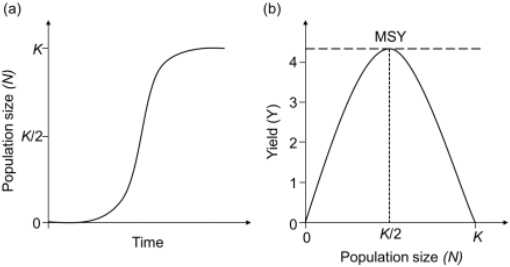

# EEB319 Lab 3: Harvesting and Stability

Name:

Lab Section:

------------------------------------------------------------------------

A bifurcation analysis involves analyzing how population equilibria and their stability properties change in relation to a parameter such as survival rate, birth rate, or in the case of this lab fishing rates. In this lab we will analyze population models for fisheries management by graphically constructing a bifurcation analysis of two fishing strategies and to appreciate how small changes in assumptions/management scenarios can have large consequences for population dynamics, stability, and the sustainability of fisheries.

**Marking:** Each question is worth 10 points, for a total of 80 points.

------------------------------------------------------------------------

## Introduction

Maximum sustainable yield (MSY) describes the largest number of individuals (or biomass) that can be taken from a population that retains the species stock for an indefinite amount of time (Figure 1). MSY is a particularly important topic in fisheries and other areas of resource management, where we are often interested in how many fish we can remove from a population whilst maintaining enough individuals to sustain the population for generations after generations.



**Figure 1**. (a) Logistic growth model; population size ($N$) as a function of time. $K$ = carrying capacity. The fastest population growth (steepest slope) of the logistic growth curve occurs at $\frac{K}{2}$. (b) Sustained yield ($Y$) as a function of population size ($N$). MSY = maximum sustainable yield occurs at the peak of the yield curve (where the slope of $Y$ is zero) where the equilibrium fish population size is $\frac{K}{2}$ (i.e. where population growth is at its maximum).

Quantifying MSY requires an understanding of population sizes ($N$), growth rates ($r$), carrying capacities ($K$), and harvest ($H$). The Schaefer model is a well-known model in fisheries that assumes logistic growth for the fish population and a harvesting function $H(N)$ that can be a function of population size: $$\frac{dN}{dt}=rN(1-\frac{N}{K})-H(N)$$

The yield from the fishery ($Y$) is equal to the harvest function $H(N)$, and for the yield to be sustainable, the fish population must be at a stable equilibrium with the fishery. For the stable equilibrium, we set $\frac{dN}{dt}=0$ which allows us to solve for the yield:

$$Y=H(N)=rN(1-\frac{N}{K})$$

The maximum sustainable yield (MSY) is the highest value of $Y$ that is possible, and this occurs at the peak of the yield curve, where the slope of $Y$ is equal to zero (Figure 1b). To find the number of individuals ($N$) removed that maximizes yield we find the peak in the yield curve by finding the point where the slope ($\frac{dY}{dN}$) is equal to zero, and solve for $N$:

$$\frac{dY}{dN}=r-\frac{2rN}{K}=0$$

which gives,

$$N_{MSY}=\frac{K}{2}$$

MSY occurs when the population abundance is half of the population's carrying capacity ($K$).

------------------------------------------------------------------------

## Part 1: Constant Fishing Effort

We have not yet specified what the harvest function is, and this depends on the fishing strategy. One scenario is to assume that fishers exert a fishing effort $e$ to capture the fish and so the harvest rate is proportional to the fishing effort and the abundance of fish, $H(N)=eN$. The model for the fish population dynamics is then:

$$\frac{dN}{dt}=rN(1-\frac{N}{K})-eN$$

which can be expressed as,

$$\frac{dN}{dt}=G(N)-H(N)$$

where,

$$G(N)=rN(1-\frac{N}{K})$$

$$H(N)=eN$$

In this model, fisheries are behaving like a Type I predator.

### Exercise 1.1

Create a plot of the growth function, $G(N)$, as a function of biomass ($N$) on the x-axis. Your plot should reflect that population growth equals zero when the population has 0 individuals, and when the population is at carrying capacity ($K$). Also identify the point of maximum population growth rate at $\frac{K}{2}$.

First, let's set up our model by stating our parameters and parameter values, and by initializing an empty vector.

```{r}
## Parameters
r <- 1 # Growth rate
K <- 1000 # Carrying capacity

## Biomass
N <- seq(1, 1000, 1)

## Empty vector
G <- c()

## Initial conditions
G[1] <- 0
```

Now, let's simulate our growth function...

```{r}
for (i in N){
  G[i] <- r*N[i]*(1 - (N[i]/K))
}
```

... And plot our results.

**Make sure to edit the `main`, `xlab`, and `ylab` arguments in the code chunk below to describe the plot, and change `eval = FALSE` to `eval = TRUE` before knitting to submit.**

```{r, eval = FALSE}
plot(G, type = "l", lwd = 2,
     main = "...", xlab = "...", ylab = "...")
```

Using the code chunks above as a guide, simulate growth functions for two populations. The first population grows more slowly than the population above. The second population has a lower carrying capacity than the population above. Make sure to re-name `G` to avoid overwriting.

```{r}

```

**Question: Discuss some life history traits that may result in a population exhibiting (1) a slow/fast growth rate, or (2) a low/high carrying capacity.**

*Type your answer here.*

### Exercise 1.2

On top of your growth function plot, plot the harvest function, $H(N)$, starting from 0 and increasing linearly (the slope is $e$). Where your harvest rate meets your yield curve is an equilibrium point. Include this plot in your lab report and indicate if the equilibria are stable of unstable.

```{r}
e <- 0.3 # Slope
N <- seq(1, 1000, 1) # Biomass
H <- c(); H[1] <- 0 # Empty vector and first position
```

Now, let's simulate our harvesting function...

```{r}
for (i in N){
  H[i] <- e*N[i]
}
```

... And plot it on top of our harvesting function.

**Make sure to edit the `main`, `xlab`, `ylab`, and `legend` arguments in the code chunk below to describe the plot, and change `eval = FALSE` to `eval = TRUE` before knitting to submit.**

```{r, eval = FALSE}
plot(G, type = "l", lwd = 2,
     main = "...", xlab = "...", ylab = "...")
lines(H, lty = 2, lwd = 2, col = "red3")
legend("topleft", legend = c("...", "..."),
       col = c("black", "red3"), lty = c(1,2), lwd = 2)
```

Sustainable yield occurs when the fish population is at equilibrium with the fishery (i.e. $\frac{dN}{dt}=0$) We'll use an asterisk ($*$) to denote that we are solving for N at equilibrium:

$$
0=rN*(1-\frac{N*}{K})-eN*
$$

Solve for $N*$ in terms of the other parameters and record your findings below. You should find two equilibria.

*NOTE: If you want to get really fancy, you can try typing your math/findings in [LaTeX](https://www.overleaf.com/learn/latex/Mathematical_expressions).*

### Exercise 1.3

Create a diagram of the number of individuals at equilibrium ($N*$) on the y-axis as a function of the harvest rate ($e$) on the x-axis. Indicate the stable and unstable equilibria. **At what value of** $e$ **does the fish population go extinct? Why?**

**Make sure to edit the `main`, `xlab`, `ylab`, and `legend` arguments in the code chunk below to describe the plot, and change `eval = FALSE` to `eval = TRUE` before knitting to submit.**

```{r, eval = FALSE}
K <- 1000; r <- 1
e_seq <- seq(0, 1, 0.1)
N <- c()
for (i in 1:length(e_seq)){
  N[i] <- (K*(r - e_seq[i]))/r
}

df <- as.data.frame(cbind(e_seq, N))
plot(df$e_seq, df$N, type = "l", lwd = 2,
     main = "...", xlab = "...", ylab = "...")
abline(v = e, lwd = 2, lty = 2, col = "blue3")
# legend(...)
```

------------------------------------------------------------------------

## Part 2: Fishery Quota

In the previous example, we assumed that the harvest rate was a product of fishing effort and fish abundance. Instead, let's assume that managers allow an annual (constant) quota that fishers are allowed to remove from the fish population (i.e. the harvest function is a constant).

$$\frac{dN}{dt}=rN(1-\frac{N}{K})-H$$

### Exercise 2.1

Plot the relationship between $G(N)$ and $N$. Also plot the constant harvest, $H$, for the case where yield is less than MSY (i.e. $H$ is independent of population size so is a horizontal line). How many points of equilibria are present? Where are these points of equilibria in relation to the MSY? Are the equilibria stable or unstable? Identify them on your plot.

**Make sure to edit the `main`, `xlab`, `ylab`, and `legend` arguments in the code chunk below to describe the plot, and change `eval = FALSE` to `eval = TRUE` before knitting to submit.**

```{r, eval = FALSE}
r <- 1
K <- 1000
H <- 150 # Constant harvesting

N <- seq(1, 1000, 1)

G <- c(); G[1]<-0

for (i in N){
  G[i] <- r*N[i]*(1 - (N[i]/K))
}

plot(G, type = "l", lwd = 2,
     main = "...", xlab = "...", ylab = "...")
abline(h = H, lwd = 2, lty = 2, col = "red3")
# legend(...)
```

### Exercise 2.2

What is the harvest rate ($N$) at MSY? **HINT:** To do this, first set $\frac{dN}{dt}=0$ and then substitute $N$ with $\frac{K}{2}$ and then solve for $H$. Report your finding.

*Type your answer here.*

### Exercise 2.3

Generate another diagram, plotting the equilibria, $N*$, on the y-axis as a function of harvest ($H$) on the x-axis. To do this, think about how the equilibria in your plot from in Exercise 2.1 change as $H$ starts at 0 and increases (no math needed). Make sure to include on your diagram the value you determined to be the number of individuals that can be sustainably removed (i.e. MSY).

```{r}

```

------------------------------------------------------------------------

## Part 3: Compare the Fishing Strategies

### Exercise 3.1

What are the implications of the two different bifurcation diagrams (i.e. constant effort in Part 1 vs the quota system in Part 2)? Why might a constant quota system be risky for fisheries management?

*Type your answer here.*

### Exercise 3.2

We've considered the case of a stationary environment (i.e. population parameters are constant). However, in a non-stationary world, where $r$ may be changing due to environmental change (natural or anthropogenic), what are the implications of the two harvesting strategies (i.e. constant effort in part 1 vs constant quota in part 2)?

*Type your answer here.*
