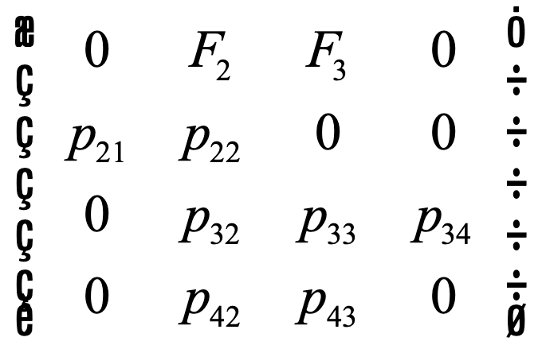

# EEB319 Lab 5: Stage-Structured Population Dynamics

Name:

Lab Section:

------------------------------------------------------------------------

**Marking:** Each question is worth 10 points, for a total of 100 points.

------------------------------------------------------------------------

## Part 1

Consider a species of marine invertebrate that has a life-history that consists of non-breeding juveniles in the first year of life and then breeding adults that can reproduce annually and live for many years. A stage-structured population model for the species can be represented by the life-history graph:

{width="335"}

Where:

|       | Parameter                                            |
|-------|------------------------------------------------------|
| $J$   | Juvenile abundance                                   |
| $A$   | Adult abundance                                      |
| $S_J$ | Annual survival of juveniles                         |
| $S_A$ | Annual survival of adults                            |
| $f$   | The number of juveniles produced per adult, per year |

### Exercise 1.1

Using the life history graph, write down two equations for $J_{t+1}$ and $A_{t+1}$.

*Type your answer here.*

### Exercise 1.2

Write down the corresponding population projection matrix (PPM).

*Type your answer here.*

### Exercise 1.3

List three assumptions of the stage-structured model.

*Type your answer here.*

### Exercise 1.4

Assume that there is an initial small colonizing population of 10 juveniles and zero adults at time $t=0$ and that the species has life-history parameters $S_J=0.1$, $S_A=0.8$, and $f=3.5$.

In the cell below, simulate the model to get a prediction for the growth of the population from the initial population size until time $t=40$. Create a single plot of two lines that represent juvenile and adult abundances over time.

**Make sure to include plotting arguments, differentiate your population abundances (using colours or line types), include a legend, and change `eval = FALSE` to `eval = TRUE` before knitting to submit!**

```{r, eval = FALSE}
## Parameters

## Time

## Empty vectors and initial conditions

## Model simulation via for loop
for (i in 2:length(t)){
  ...
  ...
}

## Plotting
plot(...)
lines(...)
legend("...", legend = c("...", "..."), col = c("...", "..."))
```

### Exercise 1.5

From your simulation, you should notice that the lines smooth out after several time steps into a familiar form of geometric population growth. Calculate the geometric population growth rate, $\lambda$, for adults and juveniles at times $t=20$, $t=30$, and $t=40$ according to the formula $\lambda=\frac{N_t}{N_{t-1}}$.

```{r}

```

What is the value of $\lambda$ for adults and juveniles at these time points? Do they differ?

*Type your answer here.*

### Exercise 1.6

Calculate the proportion of the population that are juveniles and adults at times $t=20$, $t=30$, and $t=40$.

```{r}

```

Do they differ through time?

*Type your answer here.*

### Exercise 1.7

Your answers to (1.5) and (1.6) provide two key properties of the stage-structured population that the population growth in each stage converges to a constant value and so too does the proportion of the population in each stage. These two characteristics are referred to as the dominant eigenvalue and the associated right eigenvector of the population projection matrix.

To understand these further, create a plot of your simulation in the phase plane with $J_t$ on the x-axis, and $A_t$ on the y-axis. Use round symbols connected by lines, and label on the plot the points $t=0$ and $t=40$.

```{r}

```

What pattern do you see and how does it relate to the eigenvalue and eigenvector?

*Type your answer here.*

------------------------------------------------------------------------

## Part 2

The population dynamics of the critical endangered northern right whale was studied by [Fujiwara and Caswell (Nature, 2001)](https://www.nature.com/articles/35107054). The life-history graph is as follows:

{width="340"}

Where the numbers represent different stages:

-   1: calf

-   2: immature female

-   3: mature female

-   4: mature females with newborn calves (mothers)

-   5: dead

The fecundity terms are not yet shown, but the population projection matrix that represents the life-history graph is as follows:

{width="237"}

With parameter values:

| Parameter | Value |
|-----------|-------|
| $p_{21}$  | 0.92  |
| $p_{22}$  | 0.86  |
| $p_{32}$  | 0.08  |
| $p_{33}$  | 0.80  |
| $p_{34}$  | 0.75  |
| $p_{42}$  | 0.02  |
| $p_{43}$  | 0.19  |

Note that we don't need to explicitly model dead whales as a fifth stage.

The equations for the fecundity terms that Fujiwara and Caswell use involve assumptions with regards to the sex ratio and dependence of the calf on survival of her mother:

$$
\begin{align}
F_2&=0.5*p_{42}*p^{0.5}_{34} \\
F_3&=0.5*p_{43}*p^{0.5}_{34}
\end{align}
$$

1.  A 50:50 sex ratio
2.  That there is only one calf per mother
3.  That the calf survives to independence due to the mother surviving gestation ($p_{42}$ and $p_{43}$, respectively)
4.  That the calf is dependent on the mother's survival for half of its first year of life (the $p^{0.5}_{34}$ term; this is the square root of $p_{34}$)

### Exercise 2.1

Using the symbols in the population project matrix and $n_1$, $n_2$, $n_3$, and $n_4$ for the four life-history stages, write down the four equations for the abundance for stages 1-4 in time step $t+1$ based on the abundances in time step $t$.

*Type your answer here.*

### Exercise 2.2

In the code chunk below, simulate the model for 100 years using the parameter values in the table above, and using a starting abundance of 200 whales in each stage. Plot the abundance of the four life-history stages against time. Make sure to include a legend.

```{r}
## Parameters

## Fecundity equations

## Time

## Empty vectors and initial conditions

## Model simulation via for loop

## Plotting

```

Determine population growth rates ($\lambda$) over time for each population compartment ($n_1$, $n_2$, $n_3$, and $n_4$). Plot your results (include a legend), and **state the geometric population growth rate**.

```{r}

```

*Type your answer here.*

Determine proportion of population over time for each population compartment and plot your results (include a legend), and **state the stable stage distribution**.

```{r}

```

*Type your answer here.*

### Exercise 2.3

Adjust the survival rate of mothers with calves ($p_{34}$) upwards and re-examine your simulations. **What is the smallest value of** $p_{34}$ **that is needed to reverse the population decline of this critically endangered species?**

```{r}
## Value of p34

## Fecundity equations

## Empty vectors and initial conditions

## Model simulation via for loop

## Finding geometric population growth rate

```

*Type your answer here.*

Further, assume that the population is at its stable stage distribution and that there are currently a total of 77 whales and that a key source of mortality of mothers with newborn calves is entanglement in fisheries gear. **How many mothers with calves are there?**

```{r}

```

*Type your answer here.*

**How many mothers need to be saved each year from fisheries mortality to prevent extinction (i.e. to change** $p_{34}$ **so that** $\lambda>1$**)?**

*Type your answer here.*
